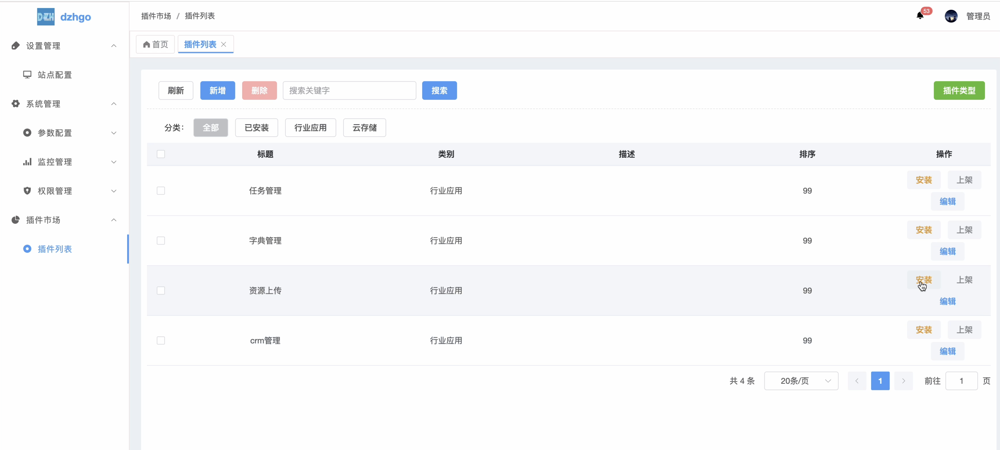

# dzhgo

## 扫码加好友拉群


## dzhgo后台界面


## 主程序dzhgo
* 后台项目地址：https://github.com/gzdzh-cn/dzhgo
* 前端项目地址：https://github.com/gzdzh-cn/dzhgo-admin-vue

 
## 插件目录
```bash
addons
├── aliyun
│   ├── api
│   ├── controller
│   ├── logic
│   ├── model
│   ├── config.go
│   ├── main.go
│   └──README.md
├── addons.go
└── README.md
```


 


