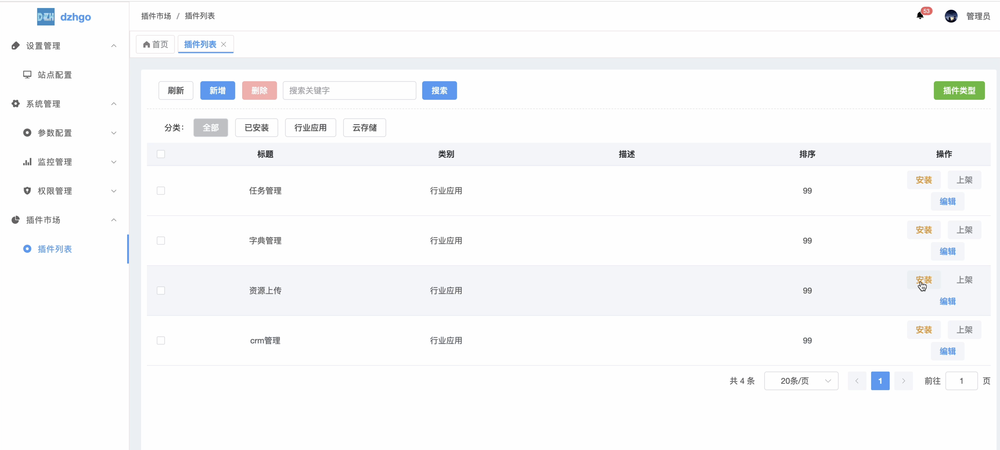

# watermark_camera 水印相机
## 扫码加好友拉群


## dzhgo后台界面


## 主程序dzhgo
* 后台项目地址：https://github.com/gzdzh-cn/dzhgo
* 前端项目地址：https://github.com/gzdzh-cn/dzhgo-admin-vue

## addons/main.go示例：
```shell
package addons

import (
	"dzhgo/addons/watermark_camera"
)

func NewInit() {
	
	watermark_camera.NewInit()

}
```


## 资源打包命令

```bash
gf pack addons/watermark_camera/resource addons/watermark_camera/packed/packed.go -p addons/watermark_camera/resource

gf gen dao -p=addons/watermark_camera -t=addons_

gf gen service -s=addons/watermark_camera/logic -d=addons/watermark_camera/service
```
